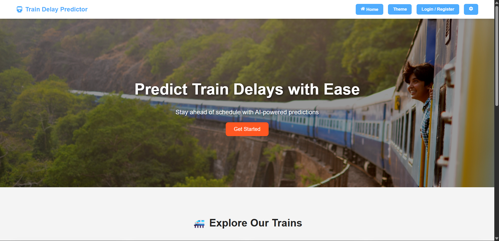

# 🚆 Train Delay Predictor

A full-stack web application that predicts train delays based on weather conditions and historical data directly from your browser.



## 📖 About

**Train Delay Predictor** is an intelligent tool designed to help commuters and logistics planners estimate train delays. By leveraging a Machine Learning model trained on historical weather and transit data, the application provides accurate delay predictions.

The system features a secure user authentication system, a personal history of predictions, and an interactive dashboard to visualize trends.

## ✨ Key Features

-   **🔮 AI-Powered Predictions**: Predict train delays in minutes based on Date, Temperature, Rain, Fog, Visibility, and Wind Speed.
-   **🔐 Secure Authentication**: User registration and login system handling secure passwords.
-   **📧 Welcome Emails**: Automated welcome emails upon registration using Flask-Mail.
-   **📊 Interactive Dashboard**: Visualizes prediction history with charts using Recharts.
-   **📜 History Tracking**: Saves all your predictions to a PostgreSQL database for future reference.
-   **📄 PDF Export**: Download your prediction history as a PDF report.
-   **⚡ Modern UI**: Responsive and animated interface built with React and Framer Motion.

## 🛠 Tech Stack

### Frontend
-   **React** (Create React App)
-   **Recharts** for data visualization
-   **Framer Motion** for animations
-   **Axios** for API requests
-   **React Icons** for UI elements

### Backend
-   **Python (Flask)**
-   **PostgreSQL** (Database)
-   **Scikit-Learn** (Machine Learning Model)
-   **Flask-Login** (Authentication)
-   **Flask-Mail** (Email Services)
-   **Joblib** (Model Serialization)

### Deployment
-   **Frontend**: Vercel
-   **Backend**: Render
-   **Database**: Neon (Serverless PostgreSQL)

## 🚀 Getting Started

Follow these instructions to get a copy of the project up and running on your local machine.

### Prerequisites
-   Node.js (v14+)
-   Python (v3.8+)
-   PostgreSQL local instance or a cloud database URL

### 1. Clone the Repository
```bash
git clone https://github.com/Rishi9911/train-delay-predictor.git
cd train_delay_predictor
```

### 2. Backend Setup
Navigate to the backend folder and install dependencies:
```bash
cd backend
python -m venv venv
# Windows
venv\Scripts\activate
# Mac/Linux
source venv/bin/activate

pip install -r requirements.txt
```
Run the backend server:
```bash
python app.py
```
The server will start at `http://localhost:5000`.

### 3. Frontend Setup
Open a new terminal, navigate to the frontend folder:
```bash
cd frontend
npm install
```

Create a `.env` file in the `frontend` directory:
```env
REACT_APP_API_URL=http://localhost:5000
```

Start the application:
```bash
npm start
```
The app will open at `http://localhost:3000`.

## 📚 API Endpoints

| Method | Endpoint | Description |
| :--- | :--- | :--- |
| `POST` | `/register` | Register a new user |
| `POST` | `/login` | User login |
| `POST` | `/logout` | User logout |
| `POST` | `/predict` | Predict delay based on weather data |
| `GET` | `/history` | Fetch user's prediction history |
| `GET` | `/profile` | Get current user profile |

## 🤝 Contributing

Contributions are welcome! Please feel free to submit a Pull Request.

1.  Fork the Project
2.  Create your Feature Branch (`git checkout -b feature/AmazingFeature`)
3.  Commit your Changes (`git commit -m 'Add some AmazingFeature'`)
4.  Push to the Branch (`git push origin feature/AmazingFeature`)
5.  Open a Pull Request

## 👤 Contact

**Rishi Chaudhari** - [GitHub Profile](https://github.com/Rishi9911)

---
*Built with ❤️ by Rishi*
